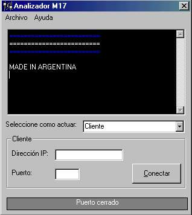



## Analizador M17

### Description

Ya no van a tener que gastar toneladas de plata en internet cada vez que esten haciendo un programa relacionado con internet. Este programa emula cualquier server o cliente dandole cualquier direccion ip a conectarse y puerto(si quieren actuar como cliente) o solo el puerto(si quieren actuar como server), podiendo ver ABSOLUTAMENTE TODA la informacion que sale y que entra. No solo sirve para hacer prueva con los programas, si no tambien para saber como funciona por ejemplo un Servidor SMTP.

Espero que lo disfruten!

Voten por este proyecto por favor!!!!!!!
 
### More Info
 
Ninguno

Te hace ver puntos azules que giran, :)

             |
---                |---
**Submitted On**   |1995-07-03 18:06:48
**By**             |[Modi17](https://github.com/Planet-Source-Code/PSCIndex/blob/master/ByAuthor/modi17.md)
**Level**          |Advanced
**User Rating**    |3.6 (29 globes from 8 users)
**Compatibility**  |VB 3\.0, VB 4\.0 \(16\-bit\), VB 4\.0 \(32\-bit\), VB 5\.0, VB 6\.0, VB Script, ASP \(Active Server Pages\) 
**Category**       |[Complete Applications](https://github.com/Planet-Source-Code/PSCIndex/blob/master/ByCategory/complete-applications__1-27.md)
**World**          |[Visual Basic](https://github.com/Planet-Source-Code/PSCIndex/blob/master/ByWorld/visual-basic.md)
**Archive File**   |[CODE\_UPLOAD7413732000\.zip](https://github.com/Planet-Source-Code/modi17-analizador-m17__1-9484/archive/master.zip)

### API Declarations

Nada de Nada

